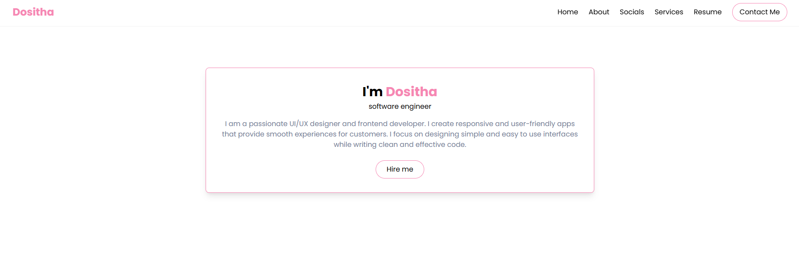

A modern, responsive portfolio website showcasing my skills, services, and projects as a UI/UX designer and frontend developer.

## Features ##
Responsive Design: Works seamlessly on all devices

## Interactive Sections: ##

--Home
--About
--Services
--Resume
--Contact

## Social Media Links github,linkedIn,whatsapp,email ##

--Modern UI: Built with Tailwind CSS
--Smooth Navigation: Fixed header with scroll interactions
--Contact Form: Functional contact section
--Social Integration: Direct links to GitHub, LinkedIn, WhatsApp, and email

## Technologies Used ##

--HTML5: Semantic markup
--Tailwind CSS: Utility-first CSS framework
--JavaScript: Mobile menu functionality
--Remix Icons: Icon library
--GitHub Pages: Deployment (optional)

## Installation ##

   1. Clone the repository:
    
  --git clone https://github.com/your-username/your-portfolio.git

   2.Open in browser:
 
   --cd your-portfolio
   --open index.html

 ## Usage ##

--Click navigation links to jump between sections
--Use contact form to send messages (requires backend integration)
--Click social icons to connect on various platforms
--Download resume using the provided button

## Customization ##

--Replace the following with your information:
--Google Drive resume link in About section
--Social media links in footer
--Contact form action URL

## Content in all sections ##

--Color scheme (change Tailwind pink-400 to your preferred color)

## Key Components ##

--Responsive Navigation: Hamburger menu for mobile devices
--Service Cards: Interactive hover effects
--Contact Form: Form validation
--Social Links: Direct platform access
--Resume Download: Google Drive integration
